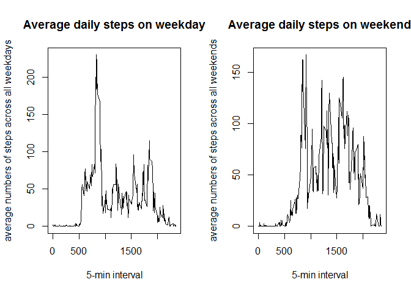

# PA1_template.Rmd
keadz2305  
March 6, 2016  


###Loading and preprocessing the data

```r
data <- read.csv("./activity.csv")
data$date <- as.Date(data$date, "%Y-%m-%d")
```

###What is mean total number of steps taken per day?

####Calculate the total number of steps taken per day

```r
aggdata = aggregate(data$steps~data$date,FUN=sum)
```

####Make a histogram of the total number of steps taken each day


####Calculate and report the mean and median of the total number of steps taken per day

```r
daymeansteps <- as.integer(mean(aggdata$`data$steps`))
daymedsteps <- median(aggdata$`data$steps`)
```

The mean total number of steps taken per day is:10766

The median total number of steps taken per day is:10765


###What is the average daily activity pattern?

####Make a time series plot (i.e. type = "l") of the 5-minute interval (x-axis) and the average number of steps taken, averaged across all days (y-axis)


####Which 5-minute interval, on average across all the days in the dataset, contains the maximum number of steps?

```r
timemaxint <- dataintmean[which.max(dataintmean$`data$steps`),]
maxtime <- timemaxint$`data$interval`
```

The maximum number of steps oocurs at 835.


###Imputing missing values

####Calculate and report the total number of missing values in the dataset (i.e. the total number of rows with NAs)

```r
stepsNA <- sum(is.na(data$steps))
```
The total numer of missing values in the dataset is 2304.


####Devise a strategy for filling in all of the missing values in the dataset. The strategy does not need to be sophisticated. For example, you could use the mean/median for that day, or the mean for that 5-minute interval, etc.

Use the mean steps for the 5-minute interval to replace missing steps values at corresponding time intervals

1. create a vector (NAindex) with the index values of the NAs in the dataset

2. create a vector (NAtime) of the corresponding time interval of the NAs

3. create a vector (NAsteps) of NAs same length as NAindex and NAtime

4. create a data frame with the 3 vectors

5. perform a to match each time interval with a corresponding means steps for that time interval

6. assign the means steps back to the datasets at the corresponding index position

####Create a new dataset that is equal to the original dataset but with the missing data filled in.

```r
NAindex <- which(is.na(data$steps))
NAtime <- data$interval[NAindex]
NAsteps <- dataintmean$`data$steps`[dataintmean$`data$interval`== NAtime[(seq(1,2304))]]
NAdata <- data.frame(cbind(NAindex,NAtime,NAsteps))
tmpNA <- merge(dataintmean,NAdata,by.x="data$interval",by.y="NAtime")
newNA <- tmpNA[,1:3]
newNA2 <- newNA[order(newNA$NAindex),]
newdata <- data
newdata$steps[NAindex] <- newNA2$`data$steps`[seq(1,2304)]
```

####Make a histogram of the total number of steps taken each day and Calculate and report the mean and median total number of steps taken per day. Do these values differ from the estimates from the first part of the assignment? What is the impact of imputing missing data on the estimates of the total daily number of steps?

```r
aggdatanew = aggregate(newdata$steps~newdata$date,FUN=sum)
```


```r
newdaymeansteps <- as.integer(mean(aggdatanew$`newdata$steps`))
newdaymedsteps <- median(aggdatanew$`newdata$steps`)
```

The new mean total number of steps taken per day is:10766

The new median total number of steps taken per day is:1.0766189\times 10^{4}


###Are there differences in activity patterns between weekdays and weekends?


####Create a new factor variable in the dataset with two levels - "weekday" and "weekend" indicating whether a given date is a weekday or weekend day.

```r
newdata$day <- weekdays(as.Date(newdata$date))
dow <- data.frame(day=c("Monday","Tuesday","Wednesday","Thursday","Friday","Saturday","Sunday"),wkday_wkend=c("weekday","weekday","weekday","weekday","weekday","weekend","weekend"))
tmpdow <- merge(newdata,dow,by.x="day",by.y="day")
newdow <- tmpdow[order(tmpdow$date),]
newdata2 <- newdow[,-1]
```

####Make a panel plot containing a time series plot (i.e. type = "l") of the 5-minute interval (x-axis) and the average number of steps taken, averaged across all weekday days or weekend days (y-axis).



